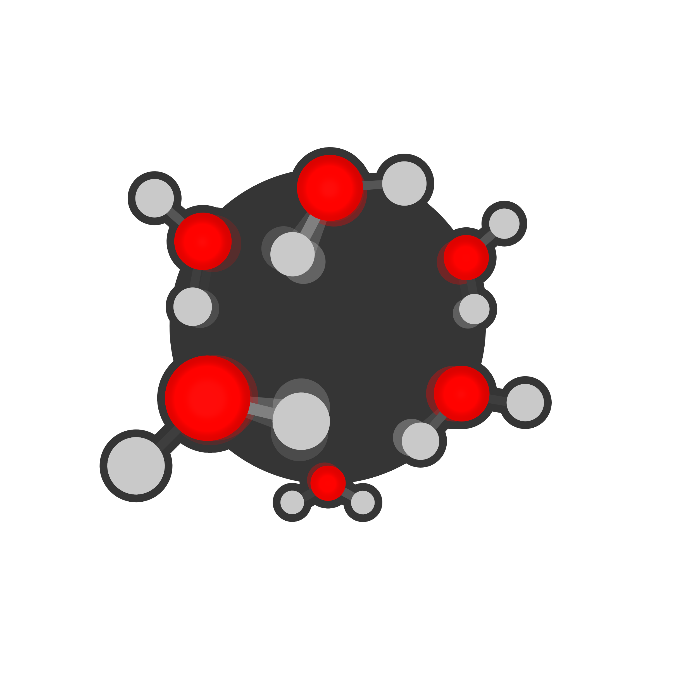
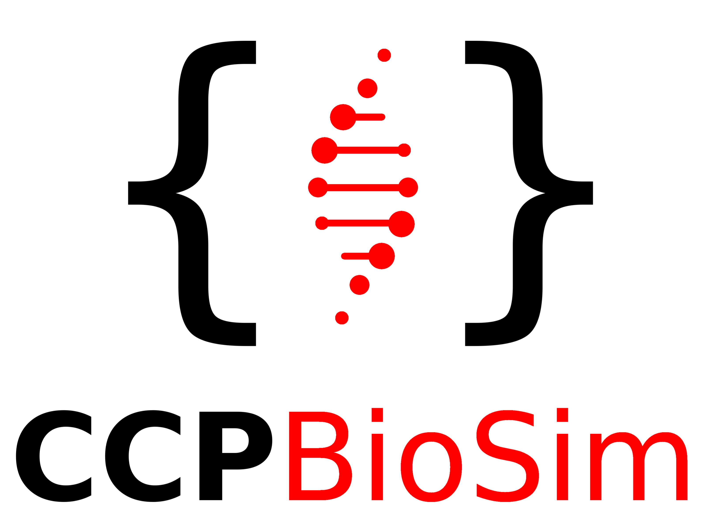

The waterEntropy Python package for molecular dynamics
======================================================

``waterEntropy`` is available at https://github.com/jkalayan/waterEntropy

.. toctree::
   :maxdepth: 2

   user_guide/index
   API documentation <apidoc/waterEntropy>

If you use this package in your research, please cite the following work:

.. highlights:: TBD, watch this space.

``waterEntropy`` is released under the MIT license.

Please contact Jas Kalayan jas.kalayan@stfc.ac.uk for information concerning ``waterEntropy``.

Funding
=======

Contributors to waterEntropy were supported by

Indices and tables
==================

* :ref:`genindex`
* :ref:`modindex`
